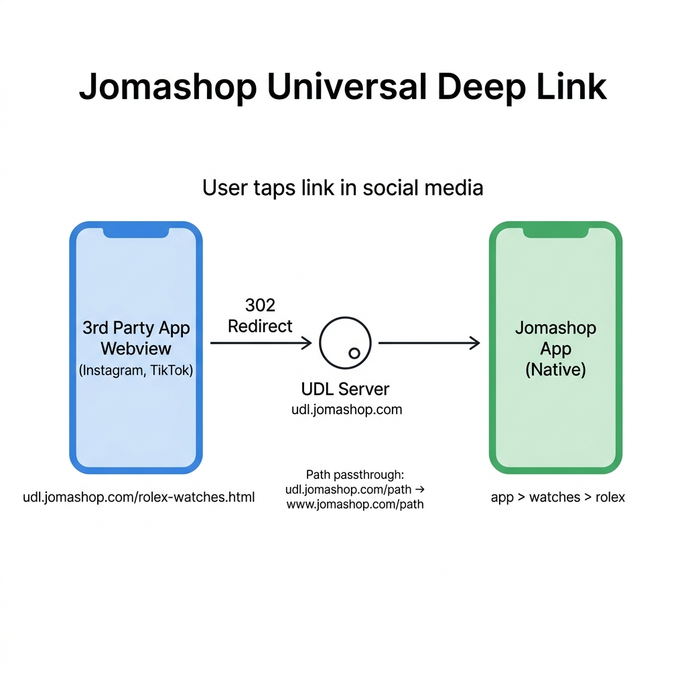

# JomaShop UDL Server

Private Universal Deep Link server for JomaShop mobile app deep linking.

## How it works

Bounces traffic through a separate domain so iOS Universal Links and Android App Links trigger correctly — even when users are browsing inside webviews (Instagram, TikTok, etc).

## Usage

All paths are forwarded to `DEFAULT_DESTINATION`:

- `https://udl.jomashop.com/` → redirects to `DEFAULT_DESTINATION`
- `https://udl.jomashop.com/watches/rolex` → redirects to `DEFAULT_DESTINATION/watches/rolex`

## Environment Variables

| Variable | Description | Example |
|---|---|---|
| `DEFAULT_DESTINATION` | Target site for all redirects | `https://www.jomashop.com` |
| `PORT` | Server port (default `3000`) | `3000` |

## Performance

Crystal + Kemal — microsecond response times.

